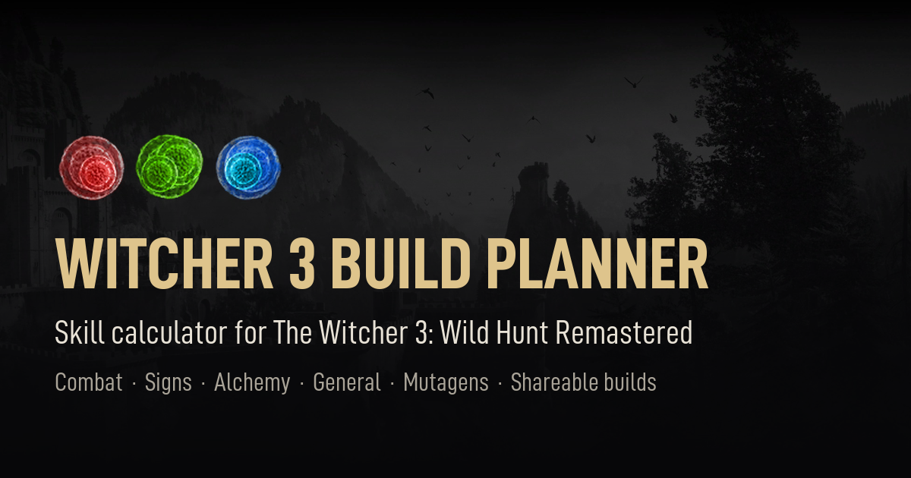

# Witcher 3 Remastered Build Planner and Skill Calculator

Free build planner and skill calculator for **The Witcher 3: Wild Hunt Remastered** (5.0, the next-gen edition). Plan Geralt's character build with the in-game Character screen layout: the Combat, Signs, Alchemy and General skill trees, three ranks per skill, the ability slots and mutagens with their bonuses.



**Live:** <https://panglot.github.io/witcher-remastered-calculator/> (updates automatically on every push to `main`).

Builds are shared as codes (`W3R1.…`) or exported as small `.txt` files that contain the code. The build you're working on is kept in the browser between visits.

## Develop

No packages to install. Needs Node.js 20 or newer.

| Command | What it does |
| --- | --- |
| `npm run dev` | Serves `public/` locally and opens it, with live reload: CSS swaps in place, other changes reload the tab. |
| `npm start` | Same, without live reload. |
| `npm test` | Runs the unit tests (`node --test`). |

The local server exists only because browsers won't load ES modules from `file://`. The live site is plain static files.

## Deploy

[.github/workflows/pages.yml](.github/workflows/pages.yml) runs the tests and publishes `public/` to GitHub Pages on every push to `main`. If the tests fail, nothing is published. One-time setup: repo **Settings → Pages → Source: GitHub Actions**.

## Layout

```text
public/                  The whole site. GitHub Pages publishes exactly this folder.
  index.html, styles.css
  social-card.png, favicon.png   Link preview and tab icon, made by tools/build_social_card.py.
  sitemap.xml            For Google Search Console.
  assets/ui/             Game UI art and layout data, generated by tools/ (manifest.json lists every file).
  assets/fonts/          D-DIN Condensed.
  data/                  Game data. No logic.
    index.js             Registers the trees, rules and skill sets.
    rules.js             Max rank, slot groups, tree order.
    mutagens.js          Mutagens (colour, size, bonus value, inventory cell) and their stats.
    skillText.js         Generated by tools/extract_skill_text.py: each skill's name, tooltip template and numbers per rank.
    skillSets.js         Skill sets: groups of related skills the Skill sets panel highlights.
    trees/*.js           One file per tree: skills (game id, game grid position) and links.
  src/
    main.js              Entry point. Creates the app context and mounts the panels.
    state.js             Page state and its localStorage copy.
    settings.js          Viewer settings (open panel sections), stored apart from the build.
    core/                Pure logic, no DOM. Covered by tests.
      catalog.js         Turns data/ into lookups (nodes, edges) and lists data mistakes.
      planner.js         Rules: unlocking, ranks, slots, mutagen bonus, passives.
      slotKinds.js       Skills in sockets and mutagens in diamonds behind one set of slot and selection rules.
      build.js           Build codes and export files.
      stats.js           What a build adds up to (points, passives, mutagen bonuses, slotted skills).
      skillText.js       A skill's tooltip text and numbers at a rank, from the data/skillText.js templates.
    ui/                  One module per panel: mountX(app) wires events and returns { render }.
      gameArt.js         Game art paths, colours, layout data loading and tree line geometry.
      gamePieces.js      SVG builders for Character-screen pieces (node, socket, diamond, tab, text).
      gamePanels.js      Panels built from the pieces (tree panel, slots, points, legend, tooltip, popup).
      backdrop.js        The game backdrop behind every page.
      tree.js, mutagenList.js, points.js, slots.js, legend.js, tooltip.js
                         The planner's Character screen, drawn with gamePanels.js.
      applyMode.js       Equipping like the game: mask, lifted item and the "Select slot" popup.
      popup.js, hold.js  The game's yes / no popup, and press-and-hold actions.
      layers.js          Layer manager: the stack of popups, apply mode, drag and menu (Esc, keys, focus, inert).
      menu.js            The Esc menu with its Build drawer and Settings and About submenus.
      sidePanel.js       Side panels: a card over part of the screen (layer, toggle, animation, accordion).
      statistics.js      The Statistics panel (C) over the tree panel.
      skillSets.js       The Skill sets panel (S) over the slots.
      share.js           Build share actions: copy, export, load, import, share links.
      buildTools.js, buildMenu.js, buildRail.js
                         The share tools as icon buttons, in the Esc menu's Build drawer and the rail right of the slots.
      options.js, tipHost.js, toast.js
                         Game-style option sliders, tooltip host and toasts.
      pageInfo.js        Fan notice in the bottom right corner, repo link, browser tab title from the build name.
server/                  Local dev server only (static files + live reload). Not deployed.
test/                    node:test suites for core/, state.js, layers.js and the real game data.
tools/                   Python scripts that pull the UI art and skill text out of a local game install.
docs/                    Notes on how the game draws the Character screen, plus reference screenshots.
research/                Local only, gitignored: decompiled game code and raw game files. Never commit it.
```

## Game art

The UI art in `public/assets/ui/` comes straight from the game files, so the planner can look like the in-game Character screen. It's committed, so you only need the tools if you want to change or rebuild it. That takes Python 3 with Pillow, Java with [JPEXS FFDec](https://github.com/jindrapetrik/jpexs-decompiler/releases) in `research/tools/ffdec/`, and the game installed:

```sh
python tools/build_ui_assets.py "<game folder>" public/assets/ui
```

What gets extracted is listed in `tools/asset-recipe.json`. [docs/game-assets.md](docs/game-assets.md) explains where everything lives in the game and how the screen is put together.

## How things fit together

- **Data → catalog → planner.** `data/` is plain objects. `core/catalog.js` validates it and builds lookups; `core/planner.js` applies the rules to a build `{ pts, slots, mut }`. Planner actions mutate the build and return `{ ok, msg }`, where `msg` explains a refusal.
- **UI panels** get one shared `app` object: `{ catalog, planner, state, msg, views, render(), save(), select(id) }`. A panel changes `app.state`, then calls `app.render()`, which redraws every panel and saves to localStorage.
- **Build codes** are `W3R1.` + base64 of the build as UTF-8 JSON `{ p, s, m, b, n }` (points, slots, mutagens, budget, name). Import finds the code anywhere in pasted text or a file, so a code in a chat message or any text file loads too.

## Common changes

- **Fix skill text or links:** edit `public/data/trees/<tree>.js`. `npm test` catches unknown ids, duplicate ids, overlapping grid cells and unreachable skills.
- **Add a tree:** add `public/data/trees/<id>.js`, import it in `public/data/index.js`, and add the id to `rules.treeOrder`. Add a `--<id>` colour in `styles.css`, and its game colour and icon folder to `TREE_ART` in `src/ui/gameArt.js`.
- **Add a skill set:** append to `public/data/skillSets.js`.
- **Change a game rule** (unlocking, slots, bonuses): `public/src/core/planner.js`, with a test in `test/planner.test.js`.
- **Add a panel:** create `public/src/ui/<name>.js` exporting `mount<Name>(app)` that returns `{ render }`, add its markup to `index.html`, and register it in `app.views` in `main.js`.
- **Change the build code format:** `public/src/core/build.js`. Shared codes live on in people's chats and files, so keep old codes loading (there's a test for that), or bump the prefix to `W3R2.` and keep reading `W3R1.`.

## Legal and credits

This is an unofficial fan work, not approved or endorsed by CD PROJEKT RED. The Witcher and all related names, icons and assets are property of CD PROJEKT RED.

- Game assets are used under the [CD PROJEKT RED Fan Content Guidelines](https://www.cdprojektred.com/en/fan-content). To stay within them, the site must remain free and non-commercial (no ads, paywalls or paid tiers; donations are allowed), keep the disclaimer visible in the page footer, not use a domain containing CD PROJEKT RED game or company names, and not be packaged as a game or mobile app.
- Font: [D-DIN Condensed](https://fontlibrary.org/en/font/d-din) by Datto, under the SIL Open Font License (`public/assets/fonts/d-din/OFL.txt`).
